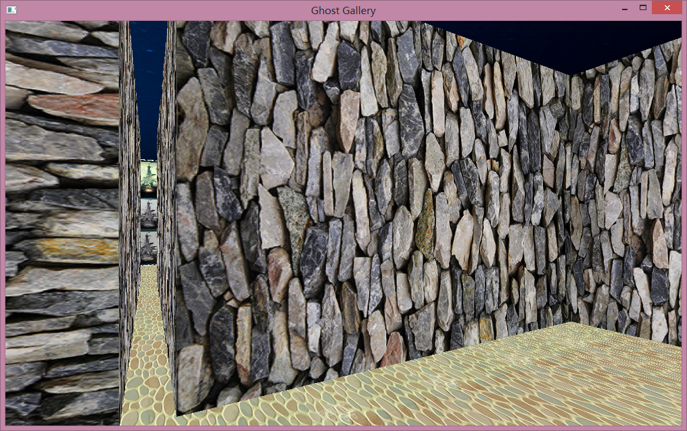
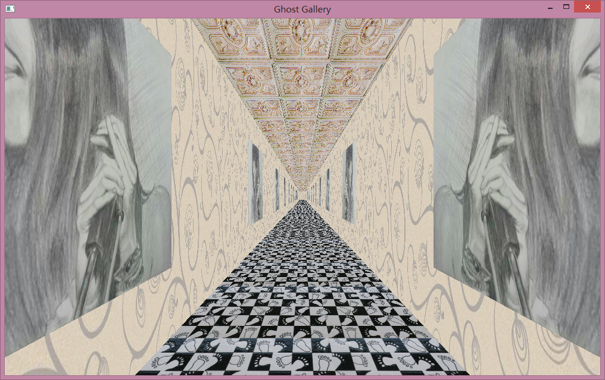
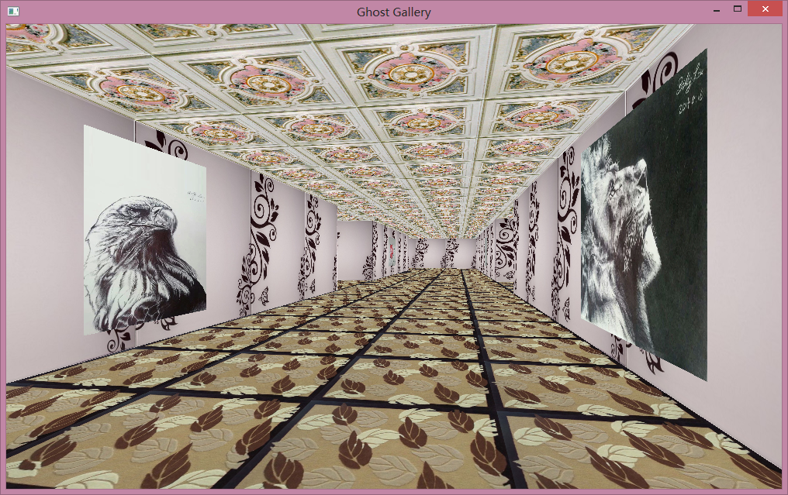
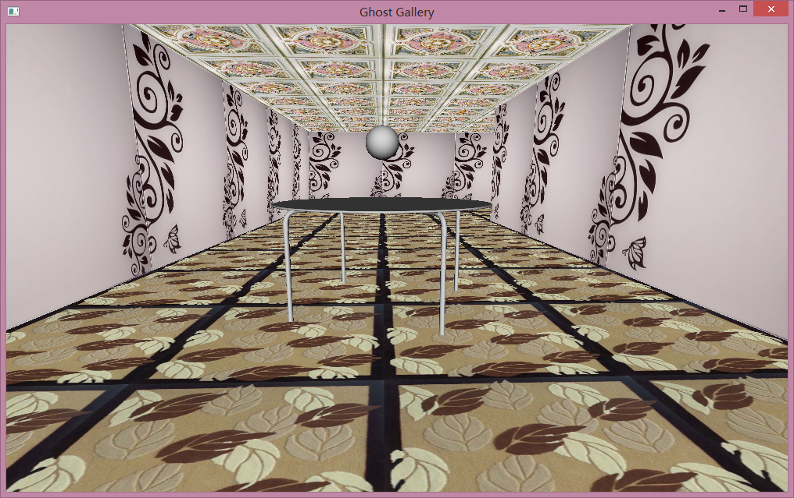
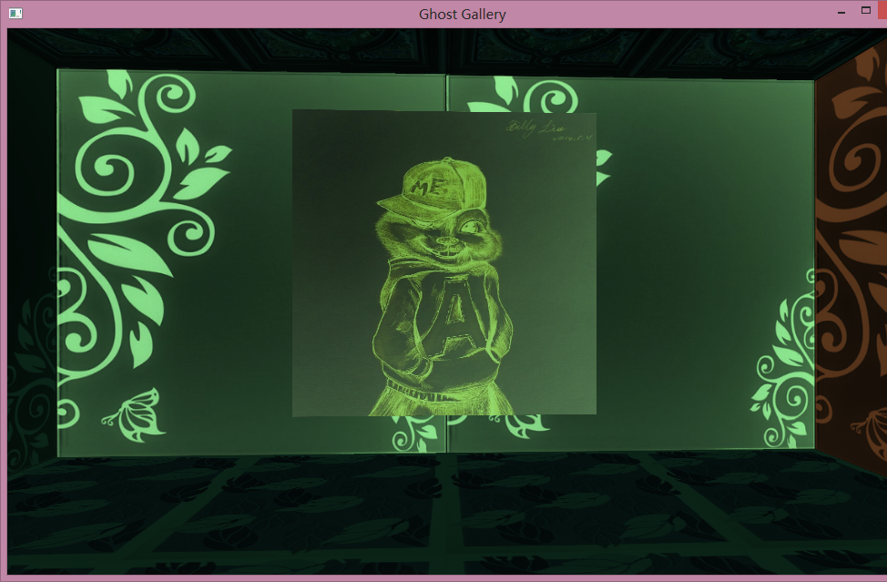
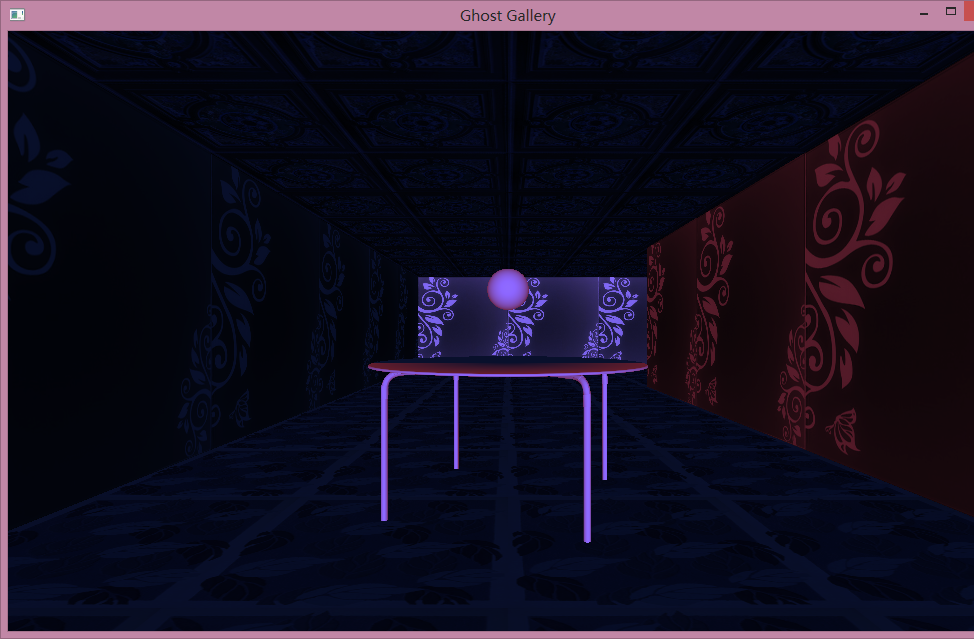

# Ghost Gallery

Ghost gallery is an escape-room game (narratives in Chinese) written in a week in June 2014. It is purely implemented in low-level OpenGL and runs on Windows (**.exe file included**).

You have to escape the gallery by solving several puzzles within time limit. For example:

#### Puzzle of the "Narrow" Wall

#### Puzzle of the "Infinite" Hallway

#### More Screenshots

#### When the light is off...

**BMG**: from video game *To the Moon*

**Pictures**: my friend DQ

**Texture**: free online, very low quality - -

**No more spoilers! Try it out yourself!**

PS: the control is a bit hard by mouse and I would suggest using keyboard.

PPS: the code and directory structure are quite messy, I don't recommend reading...

